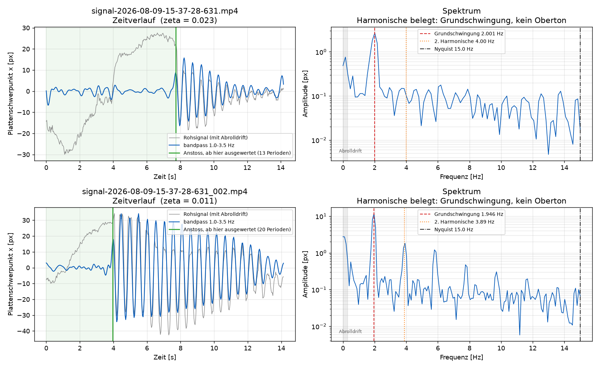
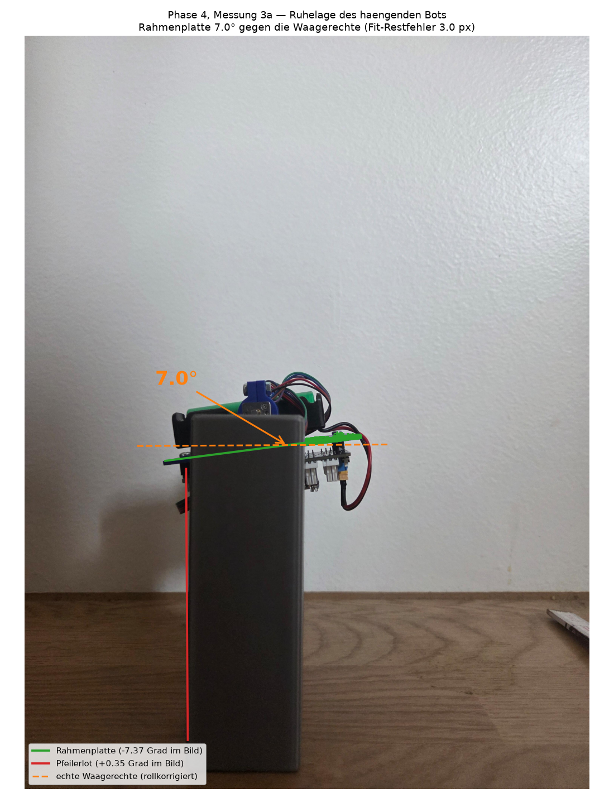

# Phase 4, Messung 3 — Schwingversuch (2026-08-09)

**Ziel:** Den instabilen Pol des Balancierproblems messen, statt ihn aus einer
Trägheitsannahme zu rechnen.

**Reproduzieren:**
```bash
python python/swing_analysis.py --videos <v1.mp4> <v2.mp4> --t-end 14.5 --L-mm 9 \
       --out messungen/results/phase4_swing_20260809.png
python python/rest_angle.py <ruhelage.jpg> \
       --out messungen/results/phase4_restangle_20260809.png
```
Die Rohmedien (2 Videos, 2 Fotos) liegen nach ADR-0002 auf NextCloud, nicht im
Repo. Getrackt sind nur die abgeleiteten Abbildungen.

---

## 1. Warum dieser Versuch überhaupt

Das Systemmodell braucht zwei Größen: die CoG-Höhe L und das Trägheitsmoment J
um die Radachse. L lässt sich mit einer Kante messen. J war bisher **geschätzt**
als `J = 1.2·m·L²` — Punktmasse im Schwerpunktabstand, plus 20 % Zuschlag.

Diese Annahme war verdächtig, weil die Masse des Bots von der Achse bis über
42 mm Höhe reicht und der Beitrag zu J quadratisch mit dem Abstand wächst. Bei
einem Bot, dessen Massen ober- und unterhalb der Achse sich im *ersten* Moment
(dem Schwerpunkt) weitgehend aufheben, im *zweiten* Moment (der Trägheit) aber
gerade nicht, ist die Punktmassennäherung strukturell falsch.

Der Schwingversuch umgeht die Frage: **Hängender und aufrechter Bot haben
denselben Eigenwert-Betrag.** Linearisiert gilt

```
haengend:  theta_dd = -(m*g*L/J) * theta      (stabil, schwingt)
aufrecht:  theta_dd = +(m*g*L/J) * theta      (instabil, kippt)
```

| Symbol | Beschreibung | Einheit |
|--------|-------------|---------|
| theta | Auslenkung aus der Ruhe- bzw. Gleichgewichtslage | rad |
| m | Körpermasse ohne Räder, 0.146 | kg |
| g | Erdbeschleunigung, 9.81 | m/s² |
| L | Schwerpunktabstand von der Radachse | m |
| J | Trägheitsmoment des Körpers um die Radachse | kg·m² |

Nur das Vorzeichen dreht sich. Die gemessene Schwingfrequenz **ist** damit der
instabile Pol — ohne dass J bekannt sein muss.

## 2. Aufbau

Räder ab, Bot ausgeschaltet, Akku eingebaut, Kabel in Betriebslage. Beide
Motorwellen auf zwei 3D-gedruckten Pfeilern aufgelegt, Bot pendelt frei um die
echte Radachse im Spalt zwischen den Pfeilern.

Warum die Wellen als Lager: Der Drehpunkt muss die Radachse sein, denn genau
darum dreht der Körper auch im Betrieb. Ein künstlicher Drehpunkt hätte einen
anderen Hebel und damit eine andere Frequenz.

## 3. Auswertemethode und warum so

**Video statt Stoppuhr.** Bei T ≈ 0.5 s verzählt man sich beim Mitzählen von
20 Perioden. Das Video liefert 30 Stützstellen pro Sekunde; die Frequenz kommt
aus dem Spektrum statt aus einer Handzählung.

**Zeitstempel aus dem Container statt Nennframerate.** Handys nehmen häufig mit
variabler Framerate auf, was die Frequenz systematisch verzerrt. Gemessen:
**30.005 fps mit 0.007 ms Streuung** — konstant, kein VFR. Diese Prüfung ist im
Skript fest eingebaut und wird bei jedem Lauf ausgegeben.

**Blaue Rahmenplatte als Marker.** Sie ist die einzige große, sättigungsstarke
Fläche am Bot. Wand (weiß), Pfeiler (neutralgrau), Tisch (braun) und Hand
(Hautton) haben alle B < R — eine Kanalabstandsschwelle (`B > R+25 ∧ B > G+15`)
trennt sie zuverlässig, ohne Modelltraining und ohne Kalibrierung auf die
Belichtung.

**Zwei Signale pro Video.** Ausgewertet werden Schwerpunkt *und*
Hauptachsenwinkel der Maske. Der Schwerpunkt hat die bessere Statistik, der
Winkel ist die physikalisch direkte Größe. Stimmen beide überein, ist das ein
Hinweis, dass die Starrkörperschwingung gemessen wurde und kein Trackingartefakt.
Vier Schätzungen (2 Videos × 2 Signale) ergeben die Streuungsangabe.

**Automatisches Anregungsfenster.** Vor dem Anstoß steht der Bot still oder wird
angefasst. Dieser Teil trägt kein Signal bei, verschlechtert aber das
Nutz-zu-Stör-Verhältnis. Das Skript sucht das Maximum der Einhüllenden — den
Anstoß — und wertet erst ab dort aus, also die freie Ausschwingung. Das allein
hat die Streuung der vier Schätzungen von 4.5 % auf 2.2 % halbiert.

**Parabolische Interpolation des Spektralgipfels.** Ohne sie wäre die Auflösung
bei ~10 s Fenster auf 0.1 Hz begrenzt, also auf 5 %.

## 4. Ergebnis



*Links: Zeitverlauf. Grau das Rohsignal mit der langsamen Abrolldrift, blau
bandpassgefiltert, grün der erkannte Anstoß. Rechts: Spektrum mit markierter
Grundschwingung, zweiter Harmonischer und Nyquistgrenze.*

| Größe | Wert |
|-------|------|
| Schwingfrequenz f | **1.974 ± 0.043 Hz** (2.2 %, 4 Schätzungen) |
| Schwingungsdauer T | 0.5067 s |
| Pol, roh gemessen | 12.40 1/s |
| **Pol, abrollkorrigiert p** | **12.14 1/s** |
| Zeitkonstante 1/p | 82 ms |
| **Verdopplungszeit t₂** | **57 ms = 5.7 Abtastschritte** bei 10 ms |
| Dämpfungsgrad ζ | 0.011 … 0.028 |

**Aliasing ist ausgeschlossen**, und zwar aus zwei unabhängigen Gründen, die
beide in der rechten Spalte der Abbildung sichtbar sind: Die Grundschwingung
bei 1.97 Hz liegt weit unter der Nyquistgrenze von 15.0 Hz, und bei 3.89 Hz
liegt ein klarer Gipfel — die **zweite Harmonische**. Ein Alias hätte keine
Harmonische an der doppelten Frequenz. Der Gipfel entsteht durch die schwache
Nichtlinearität des Pendels bei endlicher Amplitude.

**Die Dämpfung belegt, dass der Aufbau nicht klemmt.** ζ ≈ 0.02 heißt, die
Amplitude fällt pro Periode um rund 12 %. Bei einer klemmenden Welle wäre die
Schwingung nach wenigen Perioden verschwunden und die Frequenzmessung
unbrauchbar. Der Frequenzfehler durch Dämpfung beträgt ζ²/2 ≈ 0.02 % und ist
vernachlässigbar — die gemessene Frequenz ist die ungedämpfte Eigenfrequenz.

## 5. Fehlerbilanz

| Quelle | Größe | Art | behandelt |
|--------|-------|-----|-----------|
| Streuung der 4 Schätzungen | ±2.2 % | zufällig | als Unsicherheit angegeben |
| Abrollen der Welle | −2.1 % | systematisch | herausgerechnet, s. u. |
| Dämpfung ζ ≈ 0.02 | +0.02 % | systematisch | vernachlässigt |
| Amplitude θ₀ ≈ 7° | +0.09 % | systematisch | vernachlässigt |
| Zeitbasis 30.005 fps | <0.03 % | systematisch | vernachlässigt |

### Abrollkorrektur — Herleitung

Die Wellen liegen auf **flachen** Pfeileroberseiten und rollen darauf ab,
statt um ihre Achse zu drehen. *(Am 2026-08-09 am Aufbau bestätigt: Die
3D-gedruckten Pfeiler haben eine glatte, flache Oberseite ohne Nut oder
Schlitz. Die Korrektur gilt also — hätte die Welle in einer Nut gesessen und
sich darin gedreht, wäre der Rohwert p = 12.40 1/s der richtige gewesen.)* Die momentane Drehachse ist die Berührlinie,
also r = 1.5 mm unter der Wellenmitte. Mit Wellenradius r und
Schwerpunktabstand d lautet die Lage des Schwerpunkts beim Abrollen

```
x_c = -r*theta + d*sin(theta)
y_c = -d*cos(theta)
```

Die kinetische Energie wird damit

```
T = 1/2 * theta_dot^2 * [J_c + m*(d*cos(theta) - r)^2 + m*d^2*sin^2(theta)]
```

und für kleine Auslenkungen `T = ½·θ̇²·[J_c + m(d−r)²]`, während
`V = ½·m·g·d·θ²`. Daraus

```
w_roll^2  = m*g*d / (J_c + m*(d-r)^2)        gemessen
w_achse^2 = m*g*d / (J_c + m*d^2)            gesucht
```

J_c eliminiert ergibt die Korrekturformel, die im Skript steht:

```
w_achse^2 = g*d / (g*d/w_roll^2 + 2*d*r - r^2)
```

| Symbol | Beschreibung | Einheit |
|--------|-------------|---------|
| r | Radius der Motorwelle, 0.0015 | m |
| d | Schwerpunktabstand von der Wellenachse (= L) | m |
| J_c | Trägheitsmoment um den Schwerpunkt | kg·m² |
| w_roll | gemessene Kreisfrequenz beim Abrollen | 1/s |
| w_achse | gesuchte Kreisfrequenz bei Drehung um die Achse | 1/s |

Das rollende Pendel schwingt **schneller**, weil der effektive Hebel
(d − r) statt d beträgt. Der gemessene Pol ist also zu hoch, die Korrektur
zieht ab. Sie beträgt **−2.1 % und ist praktisch unabhängig von d**
(bei d = 5…30 mm zwischen −1.8 % und −2.1 %) — die Korrektur lässt sich
also anwenden, obwohl L noch nicht gemessen ist.

> **Korrektur einer früheren Aussage:** In der Diskussion war diese
> Fehlerquelle mit „Größenordnung 10 %" beziffert worden. Das war eine
> Bauchschätzung, die eine Drehung um den festen Berührpunkt unterstellte
> statt eines Abrollens. Die Herleitung oben ergibt 2.1 %. Die Richtung
> stimmte — der gemessene Pol fällt zu hoch aus —, die Größe war um Faktor 5
> überschätzt.

**Für die Wiederholung:** Wellen in flache V-Kerben legen. Das unterbindet das
Abrollen, eliminiert die Korrektur und beseitigt zugleich die langsame Drift
(siehe Abschnitt 8).

## 6. Konsequenz für das Modell

| | Modell (J geschätzt) | Messung | Faktor |
|---|---:|---:|---:|
| J bei L = 9 mm | 142 g·cm² | **875 g·cm²** | 6.2 |
| Trägheitsradius √(J/m) | 9.9 mm | **24.5 mm** | 2.5 |
| p | 30.1 1/s | **12.1 1/s** | 0.40 |
| t₂ | 23 ms | **57 ms** | 2.5 |
| Abtastschritte pro t₂ | 2.3 | **5.7** | 2.5 |

Der gemessene Trägheitsradius von 24.5 mm ist physikalisch plausibel: Der
Körper reicht von den Motoren auf Achshöhe bis zur Nano-Oberkante bei 42 mm,
eine mittlere quadratische Entfernung von rund 25 mm liegt genau dazwischen.
Die angenommenen 9.9 mm hätten bedeutet, dass die gesamte Masse dort sitzt, wo
der Schwerpunkt liegt — was hier gerade nicht der Fall ist.

**J bleibt an L gekoppelt:** J = m·g·L/p². Ohne die Knife-Edge-Messung ist J
nur bis auf diesen Faktor bestimmt. Für die Reglerauslegung ist das teilweise
folgenlos, denn Kp hängt gar nicht von p ab:

```
Kp_rad = 5*m*g*L / tau_pro_duty          (unabhaengig von p)
Kd_rad = 2.8*m*g*L / (tau_pro_duty * p)  (faellt mit steigendem p)
```

| Symbol | Beschreibung | Einheit |
|--------|-------------|---------|
| Kp_rad | P-Verstärkung in rad-Einheiten | Duty%/rad |
| Kd_rad | D-Verstärkung in rad-Einheiten | Duty%/(rad/s) |
| tau_pro_duty | Radmoment pro Duty-Prozent | N·m/% |

Die Zahlenwerte folgen aus der Polvorgabe ζ = 0.7, ω_c = 2p. Konkret gegenüber
der alten Schätzung: **Kp unverändert 8.24 %/°, Kd von 0.153 auf 0.380 %/(°/s)**
— also 2.5× mehr Dämpfung, weil das System langsamer ist als angenommen.

## 7. Ruhelage (Messung 3a)



Photogrammetrisch aus dem Standfoto. Zwei Referenzen, beide im Bild:

1. **Das Lot** — die senkrechte Pfeilerkante. Sie liefert den Rollwinkel der
   Kamera (+0.35°) und macht die Messung unabhängig davon, ob das Handy gerade
   gehalten wurde. Ausgewertet wird die Kante mit dem kleineren Restfehler; die
   andere war durch den Wandschatten gestört.
2. **Die Platte** — der Pfeiler verdeckt ihre Mitte, die beiden Enden sind frei
   und definieren die Gerade. Ein blauer Stecker unter dem rechten Ende wird
   verworfen, sonst zieht er den Fit um gut 1° schief.

**Ergebnis: 7.0° gegen die Waagerechte, rechtes Ende höher.** Restfehler des
Fits 3.0 px über 44 Stützstellen; Zwei-Punkt-Fit und spaltenweiser Fit stimmen
auf 0.09° überein.

Warum eine Waagerechte überhaupt die richtige Referenz ist: Eine 180°-Drehung
um die waagerechte Radachse bildet eine waagerechte Ebene wieder auf eine
waagerechte ab. Ist die Platte im aufrechten Gleichgewicht waagerecht, dann ist
sie es im hängenden Gleichgewicht auch — die Abweichung ist dann direkt der
Trimm.

**Vorbehalte, die das Verfahren nicht auflösen kann:**
- Dass die Platte in der Soll-Aufrechtlage tatsächlich waagerecht steht, ist
  nicht verifiziert.
- Dass die Kamera entlang der Radachse ausgerichtet war, ebenso wenig. Eine
  schiefe Blickrichtung verzerrt den scheinbaren Winkel.
- Die Akkulage ist ohne Endanschlag nicht reproduzierbar (siehe
  `CAD_BalanceBot/redesign_requirements.md`, A2). Der Wert gilt nur für die
  Lage zum Messzeitpunkt.

Der Wert taugt damit als **Größenordnung, nicht als Sollwert**.

**Belastbarer Ersatz:** Bot hängend einschalten, `hw_check` flashen, `i`
drücken, statischen Pitch ablesen. Die Abweichung von 180° ist der Trimm —
ohne geometrische Annahme, ohne Kameraausrichtung. Die 5-Hz-Ausgaberate von
`imuLive`, die für die Schwingung unbrauchbar gewesen wäre, reicht für einen
statischen Messwert völlig.

## 8. Nebenbeobachtung: die langsame Drift

Im Zeitverlauf (graues Rohsignal) liegt eine Drift mit 7–17 s Periode und
größerer Amplitude als die Schwingung selbst. Das ist das Abrollen der Wellen
entlang der Pfeileroberseiten — ein zweiter, kaum rückgestellter Freiheitsgrad.

Für die Frequenzmessung stört sie nicht, weil sie im Spektrum weit von der
Grundschwingung entfernt liegt und der Bandpass sie sauber entfernt. Sie
erklärt aber, warum der Bot beim Versuch langsam wandert, und ist ein weiteres
Argument für V-Kerben bei der Wiederholung.

## 9. Offen

- [ ] **L per Knife-Edge (Messung 1).** Erst damit sind J und die Gains
      bestimmt. Der Schwingversuch liefert die Zeitskala, nicht den Hebel.
- [ ] Trimmwinkel per IMU statt per Foto.
- [ ] Wiederholung mit V-Kerben, falls die 2 % Abrollkorrektur stören sollten
      (aktuell kleiner als die statistische Streuung — kein vordringlicher Punkt).
