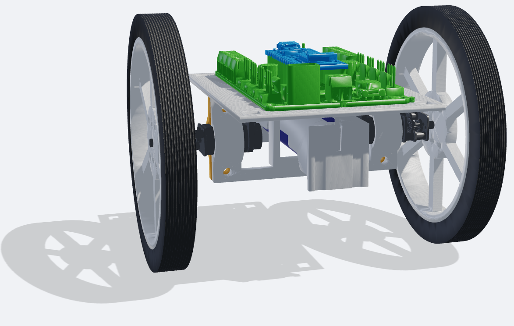

# BalanceBot



Ein zweirädriger selbstbalancierender Roboter (inverses Pendel) auf Basis
eines **Arduino Nano 33 IoT** mit **Nano Motor Carrier**.

Die Motivation hinter diesem Projekt ist es, aus den vorhandenen Komponenten
des **Arduino Engineering Kit Rev2** einen vollständig quelloffenen Roboter zu
entwickeln. Wer das Kit besitzt, kann damit den nächsten Schritt gehen und
erhält eine nachhaltige, lizenzunabhängige Engineering-Lösung.

Die Firmware ist in C++ geschrieben und wird mit **PlatformIO** gebaut. Die
Auswertekette ist Python. Der Rahmen ist ein Eigenentwurf in **FreeCAD** und
für den 3D-Druck ausgelegt.

---

## Sicherheit — vor dem ersten Einschalten lesen

Diese Regeln sind nicht kosmetisch. Der Motortreiber des Nano Motor Carrier
ist für **500 mA** ausgelegt, der **Stallstrom der N20-Motoren beträgt
1.03 A**. Ein blockierter Motor bei vollem Duty zerstört den Treiber.

1. **Bei jedem Motortest sind die Räder in der Luft.** Bot aufbocken, so dass
   die Räder frei drehen. Bodenkontakt erst, wenn der Regelkreis am Gerät
   erprobt ist — dann auf freier Fläche und in Bodennähe.
2. **Kein Motorbetrieb ohne erfolgreiche Initialisierung** von Motor Carrier
   und IMU. Schlägt eine davon fehl, bleibt die Firmware im Zustand `E_STOP`
   und gibt keine Stellgröße aus.
3. **Vor jedem Bodenversuch die Akkuspannung prüfen.** Die Stellwirkung
   skaliert direkt mit ihr. Unter **3.3 V** sind die Reglerparameter nicht
   mehr gültig.
4. **`MAX_DUTY` nicht erhöhen.** Die 45 % in `src/balance/config.h` sind die
   Ableitung aus 0.50 A / 1.03 A = 48.5 %, konservativ abgerundet.

### Hartgrenzen in der Firmware

Alle Werte in `Balancebot_code/src/balance/config.h`. Sie sind gerechnet oder
gemessen, nicht geraten:

| Parameter | Wert | Wofür |
|---|---|---|
| `MAX_DUTY` | 45 % | Stromgrenze des Treibers. Überschreiten zerstört ihn. |
| `FALLEN_ANGLE_DEG` | 45° | Sicherheitsabschaltung. Motoren stromlos. |
| `RECOVERY_ANGLE_DEG` | 15° | Rückkehr aus `FALLEN` erst unterhalb dieses Winkels. |
| `SATURATION_TIMEOUT_MS` | 1000 ms | Dauersättigung heißt, der Bot kann sich nicht mehr fangen. |
| `LOOP_OVERRUN_MS` | 50 ms | Ein Zyklus länger als fünf Perioden → die Regelung war blind → `E_STOP`. |
| `IMU_STALE_CYCLES` | 50 (500 ms) | Eingefrorene IMU-Werte → `E_STOP`. |
| `LOOP_PERIOD_MS` | 10 ms | Unterschreiten überläuft das I2C-Budget (6.4 ms Mittel, 8.3 ms worst case). |

### Die gemessenen Parameter gelten für *diesen* Aufbau

Wer den Bot nachbaut, bekommt einen anderen Rahmen, eine andere
Massenverteilung und andere Motoren aus der Serienstreuung. Diese Werte
müssen **neu gemessen**, nicht übernommen werden:

| Parameter | Hier gemessen | Bei falschem Wert |
|---|---|---|
| `DEADZONE_DUTY_POS` / `_NEG` | 23 % / 17 % bei 3.57 V | Schwingen, Gierzucken oder kein Anlaufen |
| `COG_HEIGHT_M` | Schwerpunkthöhe, Auslenkungsmethode | Modell und Verstärkungen falsch ausgelegt |
| `TOTAL_MASS_KG` | gewogen | dito |
| `KP_ANGLE`, `KD_ANGLE` | Polvorgabe aus dem gemessenen Modell, auf Totzeit herabgesetzt | Grenzzyklus oder zu träges Fangen |

Die Asymmetrie der Totzone (23 % vorwärts gegen 17 % rückwärts) liegt am
Treiber des Carriers, nicht am Motor — deshalb wird sie pro Duty-Vorzeichen
kompensiert.

> **Wenn es schwingt, nicht `KD_ANGLE` erhöhen.** Bei totzeitbedingten
> Schwingungen senkt mehr D-Anteil die kritische Totzeit zusätzlich. Der
> übliche Reflex ist hier falsch. `KI_ANGLE` bleibt 0, bis der PD-Regler
> stabil steht.

---

## Hardware

Vollständig aus dem Arduino Engineering Kit Rev2, nichts zugekauft:

| Teil | Typ |
|---|---|
| Mikrocontroller | Arduino Nano 33 IoT (SAMD21) |
| Motortreiber | Arduino Nano Motor Carrier |
| IMU | BNO055, I2C, Sensorfusion auf dem Chip |
| Motoren | 2 × N20-Getriebemotoren, 100:1 |
| Encoder | 2 × magnetisch, 1200 Counts pro Radumdrehung |
| Räder | Pololu, 90 mm |
| Akku | 1 × 18650 Li-Ion, nominal 3.7 V |
| Rahmen | Eigenentwurf, FreeCAD, 3D-Druck |

---

## Aufbau des Repos

```
Balancebot_code/
  src/balance/        Modulare Firmware — aktive Entwicklung
  src/balance.cpp     balance_v1, monolithische Referenzfassung
  src/tests/          Testsketche: hw_check, carrier_timing,
                      imu_latency, deadzone_id
  test/               Native Unit-Tests (Unity, laufen ohne Hardware)
  python/             Messkette: acquire → process → analyze
  messungen/results/  Kuratierte Messprotokolle der Inbetriebnahme
CAD_BalanceBot/       FreeCAD-Baugruppe, STEP-Modelle, CoM-Analyse
```

---

## Werkzeuge einrichten

Gebraucht werden **Python 3.11+** und **PlatformIO**. PlatformIO lädt die
Toolchain für den SAMD21 und die Bibliotheken beim ersten Build selbst.

**Linux**

```bash
python3 -m venv .venv
.venv/bin/pip install platformio
.venv/bin/pip install -r Balancebot_code/python/requirements.txt
```

**Windows (PowerShell)**

```powershell
py -m venv .venv
.venv\Scripts\pip install platformio
.venv\Scripts\pip install -r Balancebot_code\python\requirements.txt
```

---

## Bauen, flashen, beobachten

Alle Firmware-Kommandos laufen **aus `Balancebot_code/`** und sind auf beiden
Plattformen identisch:

| Zweck | Kommando |
|---|---|
| Firmware bauen | `pio run -e balance` |
| Flashen | `pio run -e balance -t upload` |
| Serieller Monitor | `pio device monitor -e balance` |
| Unit-Tests (ohne Hardware) | `pio test -e native` |
| Alle Umgebungen bauen | `pio run -e balance -e balance_v1 -e hw_check -e carrier_timing -e imu_latency -e deadzone_id` |

Unterschiedlich ist nur der serielle Port: Linux `/dev/ttyACM*` — die Nummer
wechselt nach jedem Aus- und Einschalten —, Windows `COM*`. Bei den
Python-Skripten `--port` deshalb immer explizit angeben:

```bash
python Balancebot_code/python/acquire.py --port /dev/ttyACM0   # Linux
```

```powershell
python Balancebot_code\python\acquire.py --port COM3           # Windows
```

> **`-e balance` beim Monitor ist nicht optional.** Ohne Umgebung greift
> `monitor_speed` aus der `[common]`-Sektion nicht, und PlatformIO fällt auf
> 9600 Baud zurück — die Ausgabe ist dann unlesbar.

### Verfügbare Build-Umgebungen

| Umgebung | Was sie tut |
|---|---|
| `balance` | Modulare Regelung, aktiver Stand |
| `balance_v1` | Erste funktionierende PID-Fassung, Referenz |
| `hw_check` | Interaktives Serial-Menü zur Hardware-Prüfung |
| `carrier_timing` | Misst die I2C-Latenz aller Carrier-Aufrufe |
| `imu_latency` | Misst die Dauer eines BNO055-`getEvent()` |
| `deadzone_id` | Rampt Duty hoch und loggt die Anlaufschwelle |
| `native` | Unit-Tests auf dem PC, ohne Hardware |

---

## Erste Inbetriebnahme

**Räder in der Luft.** Der Reihe nach:

1. **Unit-Tests auf dem PC** — `pio test -e native`. Braucht keine Hardware
   und zeigt, ob die Toolchain steht.
2. **`hw_check` flashen** — `pio run -e hw_check -t upload`, dann
   `pio device monitor -e hw_check`. Das interaktive Menü prüft
   Carrier-Version und BNO055-Status (`v`), Motoren einzeln (`m`), Encoder
   (`e`), IMU-Livewerte (`i`) und die Vorzeichen (`d`). `s` ist der Not-Stopp.
3. **Vorzeichen festhalten.** Erwartet wird, mit „vorwärts“ = USB-Richtung:
   Roh-Pitch 0 bei aufrecht und **positiv beim Vorwärtskippen**, vorwärts
   `M1(+duty)` und `M2(-duty)`, Encoder 1 hoch und Encoder 2 runter. Stimmt
   ein Vorzeichen nicht, wird es in `config.h` korrigiert — nicht im Regler
   kompensiert.
4. **Totzone messen** — `deadzone_id` flashen, mitschneiden, auswerten. Die
   Werte in `config.h` eintragen.
5. **Schwerpunkthöhe und Trägheit bestimmen**, dann die Verstärkungen aus dem
   Modell auslegen. `python/system_id.py` rechnet das Streckenmodell.
6. **Erst dann** `balance` flashen — weiterhin mit den Rädern in der Luft.

Die Reihenfolge ist keine Empfehlung: Jeder Schritt validiert die Annahmen
des nächsten. Wer die Totzone überspringt, tunt anschließend gegen ein
Verhalten, das gar nicht vom Regler kommt.

---

## Lizenz

[MIT](LICENSE) — Nutzung, Änderung und Weitergabe sind frei, solange der
Copyright-Vermerk erhalten bleibt. Die Software kommt ohne Gewähr; das
gilt ausdrücklich auch für die Sicherheitsgrenzen oben, die für **diesen**
Aufbau ermittelt wurden.
